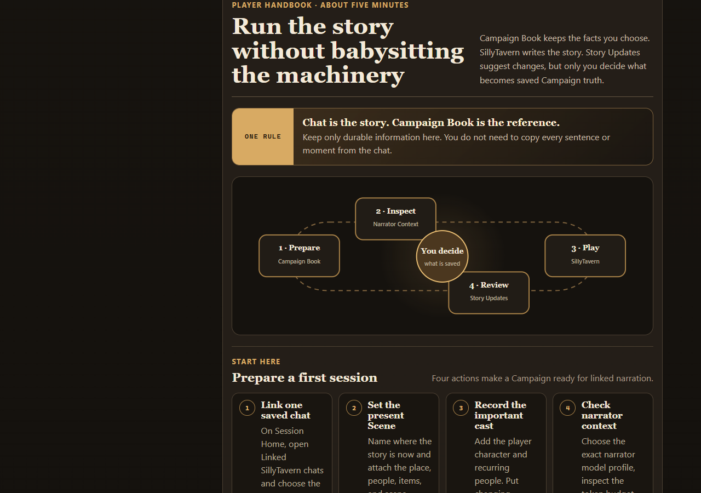
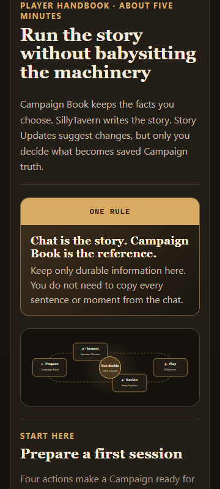

# Player Handbook

This handbook is for playing, not developing the project. It explains what to open, what to update, and what to do when a reply is blocked.

Campaign Book is at `http://localhost:8002`. SillyTavern is at `http://localhost:8001`. On another LAN or VPN device, replace `localhost` with the PC address.

## The one rule

**Chat is the story. Campaign Book is the reference.**

- SillyTavern owns chat messages, the narrator character card, generation settings, and prose.
- Campaign Book owns the durable RPG facts you choose to keep: people, possessions, abilities, quests, places, relationships, the current Scene, and changing Actor values.
- Story Updates can suggest changes from recent chat. Suggestions do not become Campaign truth until you review and apply them.

You do not need to copy every chat message into Campaign Book. Save information that should still matter several replies or sessions later.

## Start the stack

1. Start LM Studio, load the narrator model, and expose its OpenAI-compatible server on port `1234`.
2. Double-click `Wayfinder.cmd` in the project root.
3. Keep the visible Wayfinder console open.
4. Open Campaign Book and SillyTavern at the addresses above.

Campaign editing remains available if LM Studio is down. Linked narration will explain that it cannot run instead of silently bypassing Campaign context.

## Prepare your first session

### 1. Create or open a Campaign

Campaigns are independent from chats. A Campaign can survive chat changes, restarts, and new sessions.

### 2. Link one saved SillyTavern chat

On **Session Home**, expand **Linked SillyTavern chats**, choose the saved chat, and press **Link chat**.

Linking is never automatic. A chat containing fallback RPG data uses the separate **Import a fallback chat** review instead.

### 3. Set the Current Scene

Open **Current Scene** and record:

- the Scene name and short situation;
- the current Place;
- the Actors present;
- important Items and Scene Features.

These attachments help the narrator select relevant detail without receiving every Campaign record.

### 4. Add the important cast

Open **Actors**. Add the player character and anyone likely to recur.

Use **Live trackers** for changing whole numbers such as health, gold, charges, suspicion, debt, or reputation. The `−` and `+` buttons save immediately. **Edit tracker** changes the label, value, optional maximum, and notes with Save or Cancel.

### 5. Check Narrator Context

Open **Narrator Context** and:

1. choose the model profile whose model ID exactly matches the model selected in SillyTavern;
2. inspect the Campaign token budget;
3. pin records the next reply must include;
4. use **Build Context Plan** to preview selections and omissions without making a model call.

If pins alone exceed the budget, narration pauses. It never silently removes a manual pin.

## The normal session loop

### Before play

Open **Session Home**. Its recap is assembled from saved Campaign data without a model call. It shows the current Scene, latest closed Scene, outcomes, open threads, active Quests, and Live trackers for Actors in the Scene.

### During play

Update only what changed:

- use Live Tracker `−` and `+` for immediate numeric changes;
- use Save or Cancel for multi-field edits;
- use **Quick add** when the story invents a person, object, place, or objective you want to keep;
- enrich that minimal record later when play slows down;
- use **Find anything** when you remember a detail but not its collection.

### After a scene

Open **Current Scene** and use **Advance Scene**. Record the outcome and unresolved threads, choose what carries forward, then open the next Scene. The closed Scene remains immutable in **Past Scenes**.

Open **Story Updates** when you want the Campaign Worker to analyze recent unseen chat. Review and edit every suggestion. **Apply reviewed updates** is the only action that makes accepted suggestions Campaign truth.

## Where information belongs

| Collection | Put this here |
|---|---|
| Actors | Persistent people and creatures; descriptions, aliases, visibility, and Live trackers. |
| Items | Gear, keys, books, evidence, gifts, and other durable objects. |
| Abilities | Reusable spells, skills, and feats; who knows them, preparation, and remaining uses. |
| Quests | Active or completed goals and their related people, places, and facts. |
| Places | Rooms, buildings, regions, exits, and the Scene Features located there. |
| Facts | Lasting truths about an Actor, Item, Quest, Place, Ability, or Scene Feature. |
| Relationships | Directed links such as trust, rivalry, employment, debt, or obligation. |
| Current Scene | The present situation and the records structurally in play now. |

The **Relationship Map** shows current directed links on desktop. The route list underneath is the keyboard and phone view; either Actor name opens that Actor.

## What the narrator receives

Campaign Book does not jam the entire database into every prompt.

- **Automatic choices** can come from the current Scene, exact names in recent chat, text search, and a small number of related records.
- **Manual pins** remain included until you remove them.
- **Omissions** are visible in the Context Plan with token use and reasons.
- A selected Actor includes its relevant Live trackers. Unrelated Actors and their trackers are not dumped globally.

Every record has a visibility choice:

- **Story knowledge:** the narrator may use and reveal it.
- **Behind the scenes:** the narrator may use it for consistency but should not reveal it directly.
- **Player notes:** visible to you and never sent to the narrator.

## Know when something saves

- **Immediate:** Live Tracker `−`/`+`, simple counters and toggles, archive, and restore.
- **Save or Cancel:** editors containing several related fields.
- **Review then apply:** Story Update proposals.

Every accepted Campaign change advances immutable history. A stale tab cannot overwrite a newer revision.

## When generation or editing is blocked

### “Campaign changed since this chat last followed it”

The chat is anchored to an older Campaign revision. Open **Narrator Context**, review the mismatch, then choose **Follow current Campaign**. Campaign edits never move a chat automatically.

### “This tab is out of date”

Another tab or device saved a newer revision. Nothing from the stale edit was written. Keep the draft, load the latest Campaign, and reapply it if it still belongs.

### LM Studio is unavailable

Start the LM Studio server and load the configured model. Then retry from SillyTavern. Campaign editing remains available.

### Campaign Book is unavailable

Linked narration fails closed instead of generating without Campaign context. Keep the page open, restart Wayfinder if needed, press **Refresh status**, and retry.

### The browser warns about unsaved changes

Choose whether to remain on the editor. Save the form or use its Cancel action before navigating away.

## Backups and fallback

Campaign truth lives in the Companion's SQLite database. Campaign Book creates verified daily backups and supports labelled backups and restore previews.

Use `Wayfinder.cmd backup Before-finale` before a risky session or import. Use Campaign Book's **Backups and Restore** panel to preview a restore before confirming it.

The working fallback extension remains installed. Switching authority is explicit; the two histories are never silently merged.

## Phone view

The Handbook, collection forms, Actor trackers, and Relationship routes collapse to one column around 360 CSS pixels. Use the PC's LAN or VPN address with ports `8001` and `8002`.

Desktop browser automation verifies the narrow layout, but it does not replace the separate real-phone acceptance gate.
